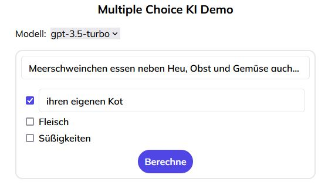
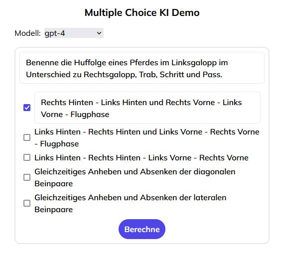

# Multiple Choice KI Demo

This is a small sample application of how AI can assist in the creation of learning materials.

This project is part of internal research of [Schule 4.0](https://www.schule4-0.de/).

The related blog post will appear soon on the official [Schule 4.0 Blog](https://www.schule4-0.de/blog/).

## Examples

gpt-3.4-turbo with minimal instructions

gpt-4 with maximum instructions

## Usage

In order to run the app locally, you need an **OpenAI API Key**.

Set your key under the `REACT_APP_OPENAI_API_KEY` environment variable.
